**在写作业之前请阅读下面的作业指南和UCloud指南，尤其是UCloud指南，开过光的，保你代码不丢，不看指南的同学代码消失了不管哦。**

**看看呗，做readme又不赚钱，交个朋友嘛ԅ(≖‿≖ԅ)**

# Assignment1 作业指南 （Deadline：2020年4月15日！！每晚提交一天总分减少10分）

## 第一次上手会有坑，请立即开始着手作业

在本次作业中，你将练习使用kNN、SVM 或 Softmax分类器来构建一个简单的图像分类器。本次作业的目标如下：

- 了解基本的**图像分类器**和数据加载方法（训练/预测阶段）
- 理解训练/验证/测试的**切分**以及验证数据在**超参数**调整中的使用。
- 熟练的使用numpy编写高效的**向量化**代码
- 完成并使用**kNN**分类器
- 完成并使用**SVM**分类器
- 完成并使用**Softmax**分类器
- 完成并使用**双层神经网络**分类器
- 了解这些分类器之间的差异和优劣
- 通过使用比原始像素更高级的图像表达形式（例如颜色直方图，梯度直方图（HOG）等特征）来学习如何优化分类器

## 作业安排以及记分方法

**练习一：**kNN分类器（25分）

​	Jupyter Notebook的 **knn.ipynb**文件将引导你实现kNN分类器。

**练习二：**训练一个支持向量机(25分)

​	Jupyter Notebook的 **svm.ipynb**文件将引导你实现SVM分类器。

**练习三：**实现Softmax分类器(25分)

​	Jupyter Notebook的 **softmax.ipynb**文件将引导你实现softmax分类器。

**练习四：**双层神经网络(25分)

​	Jupyter Notebook的 **two_layer_net.ipynb**文件将引导你实现双层神经网络分类器。

**附加练习：**更高级的表示方式：图像特征(10分)

​	Jupyter Notebook的 **features.ipynb**文件将引导你实现一个使用图像特征作为训练数据的分类器。通过特征提取可以使得分类器获得更好的表现。本练习作为附加题。

------

[TOC]

------

# UCloud指南

本课程作业将在UCloud平台上完成（注意，你可以使用自己的笔记本，不过需要自己配环境，尤其后两次作业会使用GPU）。

登录 UCloud https://edu.ucloud.cn/

## 选择UAI-train产品

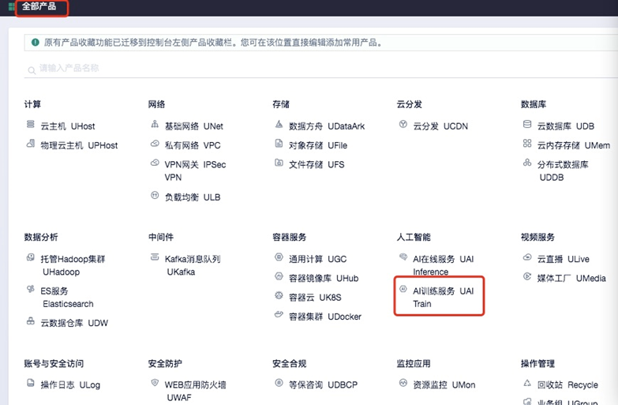

## 选择AI交互式训练

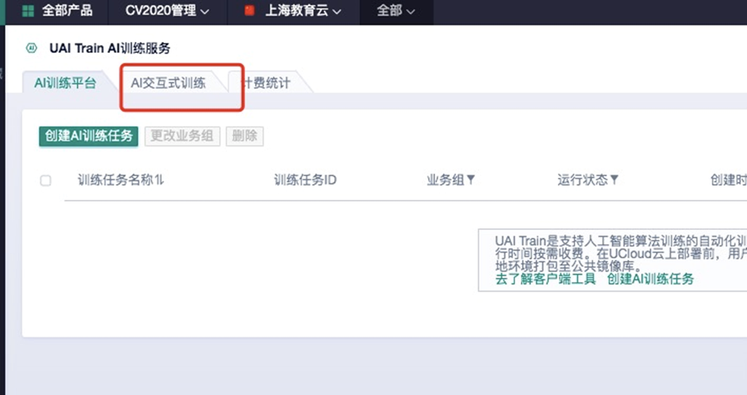

## 点击创建交互训练任务

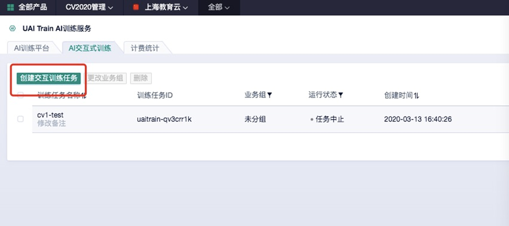

## 创建AI交互训练任务

- 名称随意，环境默认，填入访问密钥（见下），其余默认。

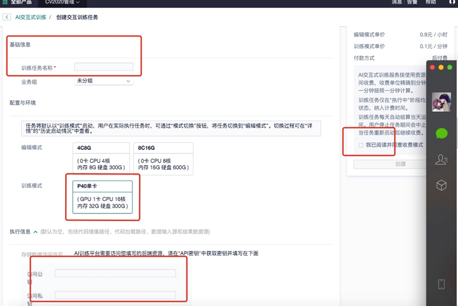

## 访问密钥

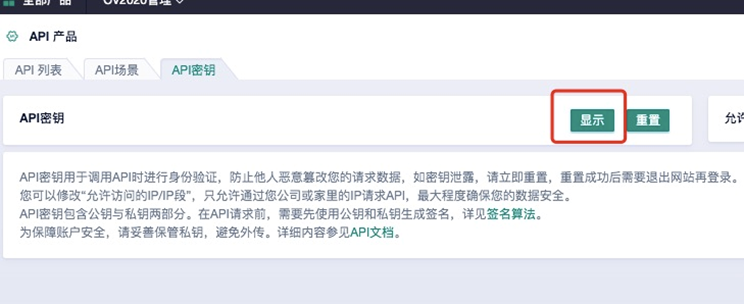

## 切换任务模式

### ******训练模式=GPU，编辑模式=CPU，前两次作业基本都**必须**切换到编辑模式来节省开销，可以**节省几十倍**!!!******

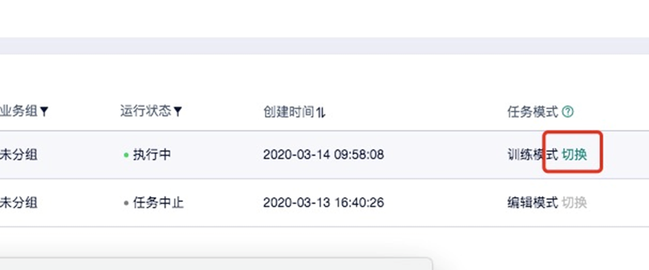

- 存储镜像并再次填入密钥
  - 存储镜像是因为虚拟机要重启
  - 选择镜像仓库，镜像名随意

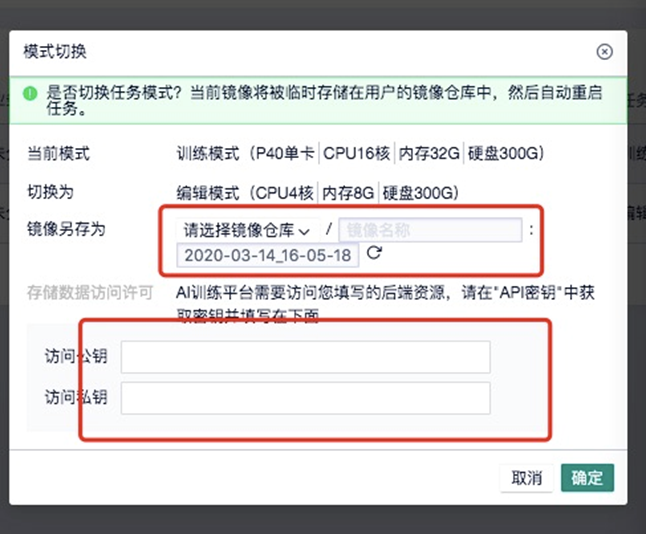

## 运行Jupyter

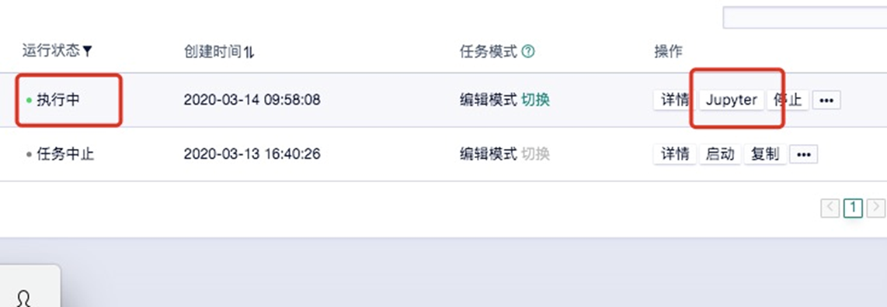

## 作业部署

* **作业下载**

  把学院的Gitlab中的`2020_ecnu_dase_cv_assignment`项目fork到自己的库中，详细参见“terminal和git使用方法.md”

* **ucloud上作业镜像保存**

下载完毕后，由于默认镜像不会保存，所以作业部署完毕好后一定要**保存镜像**，另存为一个私有镜像，否则停止任务后代码就都**消失啦！！！**

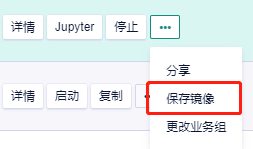

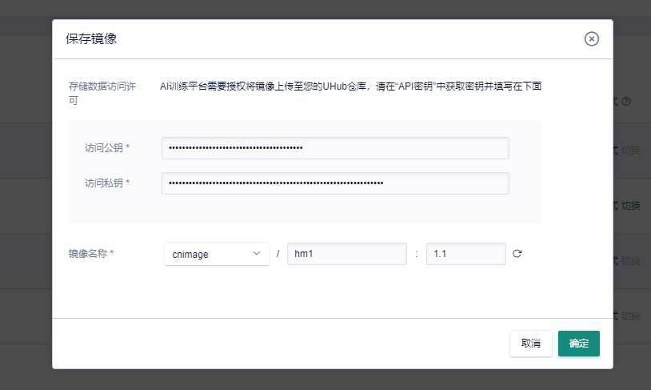

## 停止任务（**切记，不使用时请停止以节省开销**）

每次**增 删 改**后，包括在terminal里面安装了新的软件，停止任务前也一定要**保存镜像！！！** **不保存镜像 == 删库跑路**

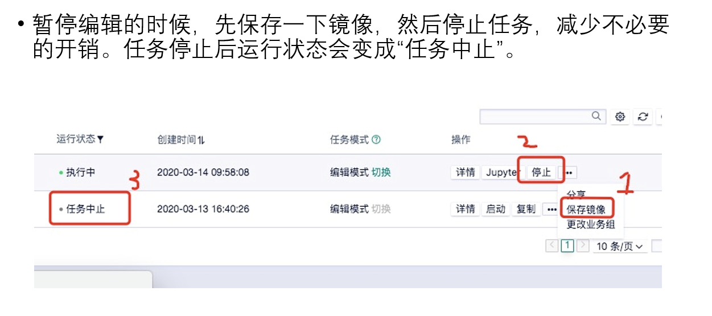

## 作业提交

* **pdf生成**

请把五个.ipynb文件下载为pdf，然后打包提交至稍后指定的服务器。

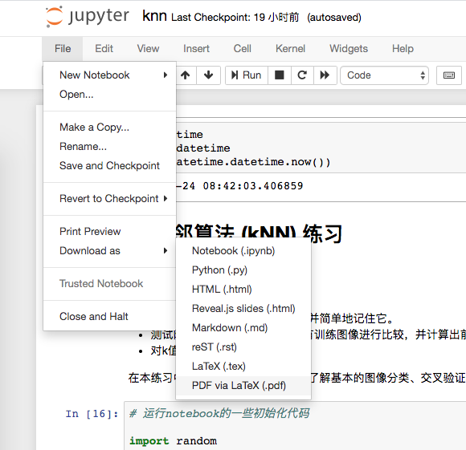

* **安装pdf生成软件**

1）打开terminal（参见“terminal和git使用方法.md”）

2）apt-get update

3）apt-get install -y texlive-xetex（安装latex）

4）apt-get install -y texlive-lang-chinese（安装latex中文支持）

******第3）和第4）步有两个包比较大，往往会因为网络原因中断，只需要不断重复执行即可完成，不用重复执行第2）步。如果一直中断，请换一个时间再尝试********

5）mv /opt/conda/lib/python3.6/site-packages/nbconvert/templates/latex/article.tplx /opt/conda/lib/python3.6/site-packages/nbconvert/templates/latex/article.tplx.bak

6）cp /data/2020_ecnu_dase_cv_assignment/utility/article.tplx /opt/conda/lib/python3.6/site-packages/nbconvert/templates/latex/ （替换latex模板）

7）回到jupyter测试是否能下载pdf，如能下载则大功告成。退出前记得保存镜像，否则上述安装包将会丢失。