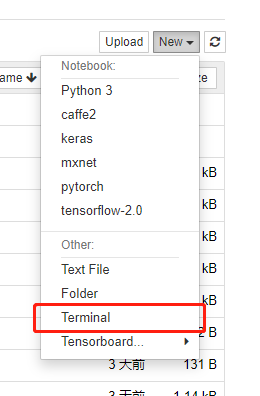
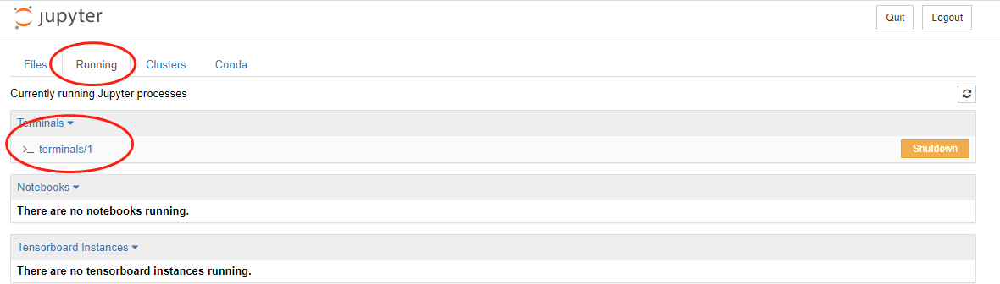
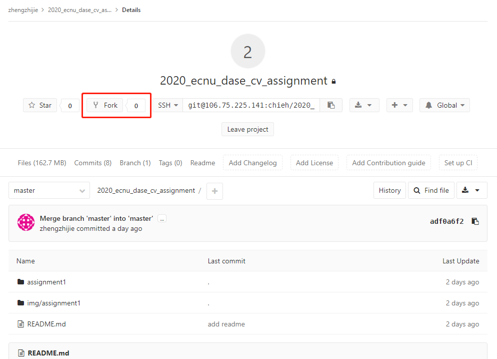
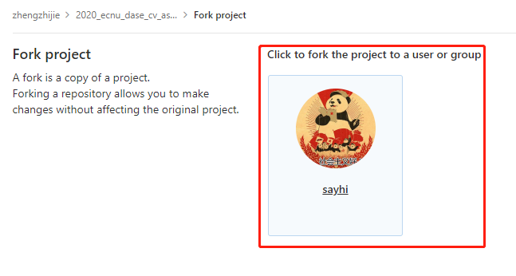
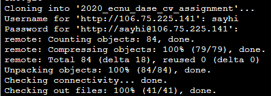
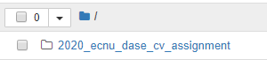
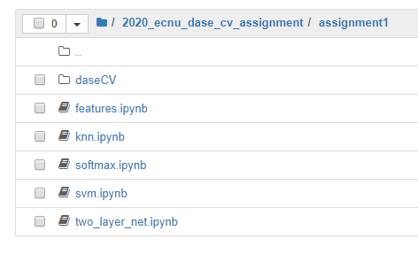
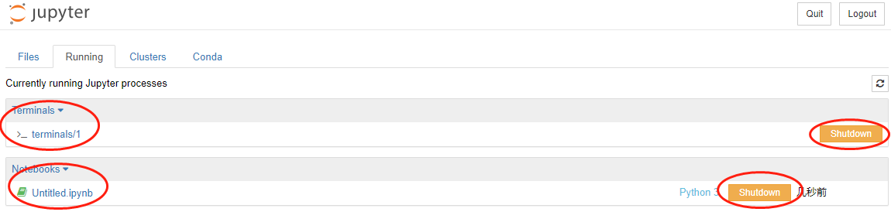

# UCloud中AI交互式训练的Jupyter notebook环境下Terminal和git使用教程

## 教程目的

本教程目的在于教会你再ucloud的AI交互式训练的`jupyter notebook`环境下使用Terminal和git进行作业的下载和上传，由于2020年春学期的计算机视觉课程采用gitlab作为作业分发和上传平台，所以建议各位同学仔细阅读本教程，掌握git的使用方法。

## 在Jupyter notebook中打开Terminal

1. new -> Terminal



​	会自动弹出Terminal，如果没有去Running -> Terminals里面找

​	

## 在Terminal中安装git

因为是新建的AI交互式训练，所以该虚拟机是clean的，需要自己装包，执行如下命令

```shell
apt-get update
apt install git
```

安装好git后，因为git是分布式版本控制软件，所以请自报家门，配置用户名和邮箱

```shell
git config --global user.name "xxx"
git config --global user.email "xxx@xxx"
```

可以用`git config -l`查看你的配置是否生效，******配置完毕后切勿直接关闭terminal，请先立即保存镜像！！！！！！******


## fork并下载作业
### (还没有gitlab账号的同学请前往学院gitlab注册，并建立个人仓库。学校内网访问http://10.24.4.234/，外网访问http://106.75.225.141/)
### (注意，请把仓库设为私有，否则互相可以看到作业，进入仓库-->点击右侧"settings"-->expand "Permissions"-->Project visibility设为private)

计算机视觉课，作业链接：http://106.75.225.141/chieh/2020_ecnu_dase_cv_assignment


### 打开链接，点fork，把该项目fork到自己的仓库中






### clone自己的仓库到jupyter中

Jupyter notebook的工作目录在`/data`下面，所以要切换到`/data`目录执行`git clone`命令

```shell
cd /data
git clone http://106.75.225.141/USER_NAME/2020_ecnu_dase_cv_assignment
```

**注意：由于UCloud 的AI交互式训练禁止了ssh功能，因此git只能通过`http`协议进行访问，所以在使用的时候请不要使用诸如`git@106.75.225.141:XXX`的链接**

然后输入你在gitlab上的用户名和密码，开始下载



下载成功后你会在jupyter里看到这个文件夹





## Coding！

检查一下clone下来的作业文件是否完整，然后就开始coding吧！


## push代码和提交作业

做好作业之后，记得保存代码，然后切到Terminal中开始进行`git push` （窍门：代码更改后及时push，即使jupyter任务没有保存就停止，下次也可以从git拉下来）

```shell
cd /data/2020_ecnu_dase_cv_assignment # git操作要在项目目录下面操作
git add . # 添加你修改后的作业文件
git commit -m "finsh XXX(your homework) by XXX(your name)" # 提交你的修改到本地仓库，注意在-m后面写清楚完成了/修改了哪些文件，以及是哪位小仙女/男提交的哦
git push origin master # 把本地仓库提交到你自己的gitlab仓库
```

>  更多git命令请查看git文档：https://git-scm.com/doc

这样你的代码就已经同步到你自己的gitlab仓库了，除此之外，请将作业的`.ipynb`文件生成pdf文件，提交到作业服务器（稍后公布提交方法）。

## 关闭Terminal和notebook

保持释放内存的习惯，当你完成一个`ipynb`或者不用一个Terminal的时候，记得把他关掉，否则会一直占用服务器资源，可能会导致你的下个作业出现内存不足的问题。

在Running -> Terminals or Notebooks里面，找到你想关闭的任务，点右侧的shutdown



