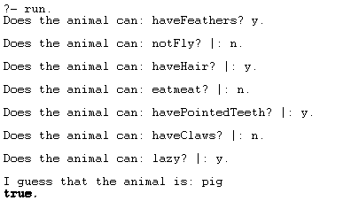

# Usage

- install `SWI-Prolog` from [here](http://www.swi-prolog.org/Download.html).
- open `animal.pl` with `SWI-Prolog` 
- type `run.` to run the system
- answer system question with `yes` or `no`, and don't forget add `punctuation mark` when reach the end of your answer
- instruction as follows:
- 

# detail

- there are 8 animals with different characters:
  - penguin
  - leopard
  - pig
  - giraffe
  - ostrich
  - zebra
  - tiger
  - albatross
- 4 Species:
  - predator
  - ungulate
  - mammal
  - bird